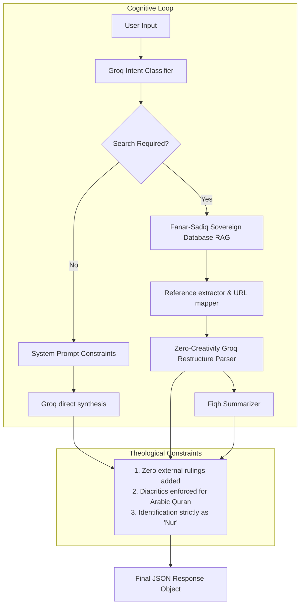
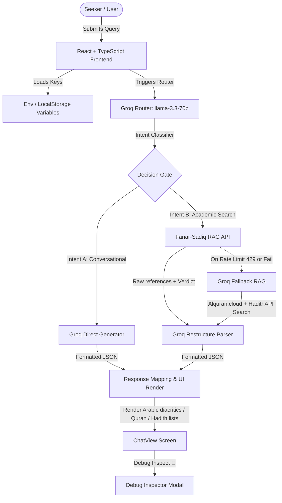
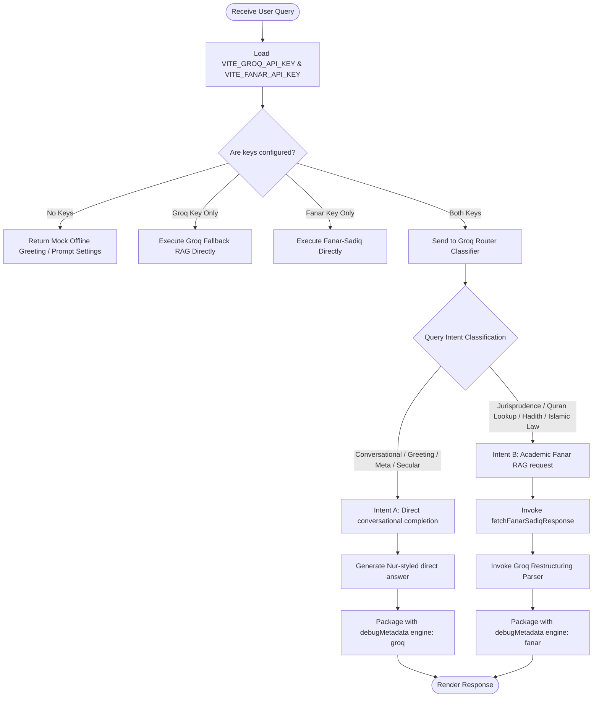
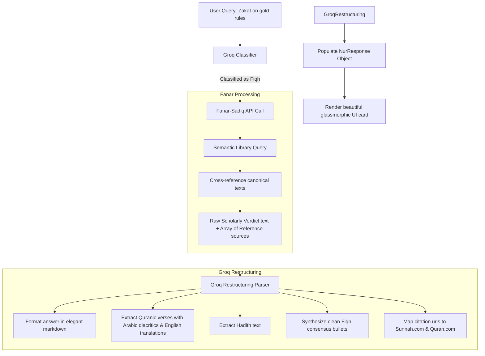
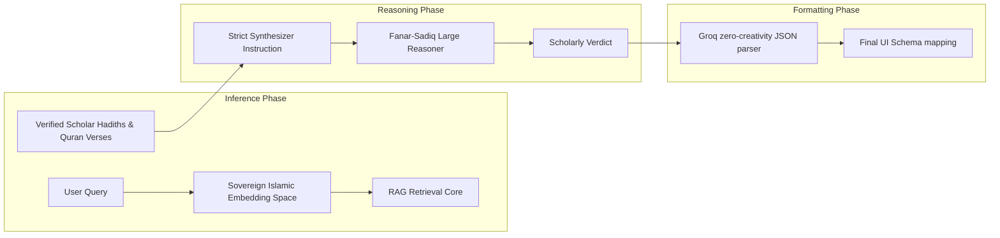
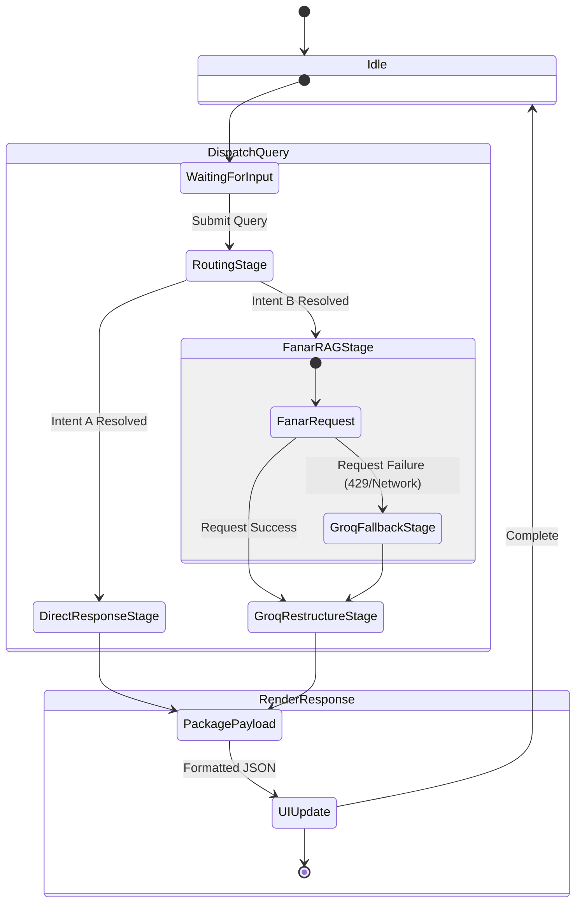

# Cognitive Architecture & System Dynamics

Welcome to the deep architectural specification of **Nur**. This document details the cognitive pipelines, agentic workflows, inference processes, and execution states that power Nur's high-fidelity, rate-limit preserving Islamic RAG architecture.

---

## 1. Cognitive Architecture Diagram

The cognitive architecture governs how Nur consumes user input, models constraints, and directs flows to enforce maximum theological authenticity while executing under tight rate limits.

---

## 2. Agentic Workflow Diagram

The agentic workflow manages multi-stage database retrievals, validation cycles, and failover fallbacks.

---

## 3. Decision Pipeline

The Decision Pipeline resolves routing gates when both keys are loaded, preventing extraneous queries from hitting the premium sovereign database.

---

## 4. Processing Pipeline

The detailed processing sequence illustrating how raw database extracts are ingested, categorized, mapped, and structured into beautiful, diacritically correct UI arrays.

---

## 5. Reasoning & Inference Pipeline

The reasoning pipeline represents the semantic embedding extraction and deduction states.

---

## 6. Execution Graph (State Machine)

The state-transition flow governing frontend execution cycles, network requests, and fallback routing actions.

---

## Model Specifications & Theological Constraints

### 1. Unified Engine Specs
*   **Groq Supervisor**: `llama-3.3-70b-versatile` in JSON mode. Chosen for ultra-low latency inference, high adherence to complex structured schemas, and exceptional instruction compliance.
*   **Sovereign Islamic RAG Engine**: `Fanar-Sadiq` on QCRI's Sovereign Islamic API. Fine-tuned specifically on verified Islamic literature, classical texts, jurisprudence catalogs, and authentic Hadith corpora.

### 2. Zero-Creativity Restructuring Guardrails
To prevent AI hallucinations in Islamic rulings (which is a grave issue in classical LLMs), the Groq parsing prompt is restricted by **zero-creativity guardrails**:
- **Strict Ingestion**: The parser is forbidden from drawing from its generic pre-trained weights to formulate jurisprudential arguments. It must syntactically format **only** what the Fanar RAG engine retrieves.
- **Canonical Reference Mapping**: RAG citations are automatically mapped to verified digital domains ([Quran.com](https://quran.com) and [Sunnah.com](https://sunnah.com)).
