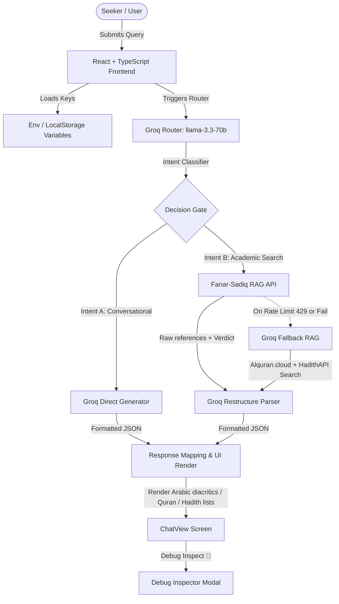
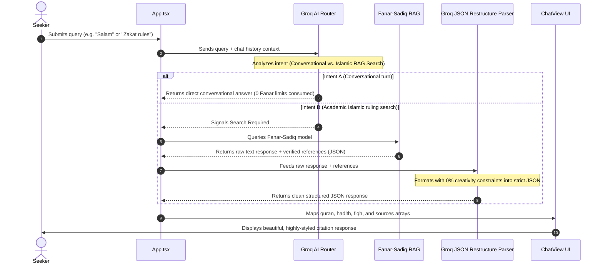

# 🕌 Nur: Unified Groq + Fanar Sovereign Islamic AI Companion

> **An enlightened, high-fidelity AI companion dedicated to authentic Islamic knowledge, powered by a unified Groq routing engine and QCRI's sovereign Fanar-Sadiq RAG catalog.**

---

[](LICENSE)
[](https://vite.dev)
[](https://react.dev)
[](https://typescriptlang.org)

**Nur** is a state-of-the-art Islamic companion application. Utilizing a **dual-engine cognitive architecture**, it is designed to deliver verified, citation-backed Islamic answers while strictly preserving rate limits of specialized sovereign APIs. 

Through its **Groq-supervised smart router**, Nur evaluates incoming query intents instantly:
*   **Intent A (Conversational turn)**: Greetings, polite dialogue, or capability/meta questions are completed instantly by Groq (`llama-3.3-70b-versatile`), consuming **zero** Fanar API limits.
*   **Intent B (Academic Search)**: Jurisprudence, Quran lookups, Hadith authentication, or formal rulings are delegated to QCRI's **Fanar-Sadiq** Islamic model, processed, and restructured under a zero-creativity synthesis gate.

---

## 🎨 Design Aesthetics & Visuals

Nur features a premium, state-of-the-art cinematic workspace:
*   **Ambient Backdrop Shaders & Stardust Particles** that drift based on cursor movement.
*   **Glassmorphic Design System** containing sleek dark mode panel grids and harmonious gold HSL tailored color schemes.
*   **Interactive Citation Drawer** showing verified references mapped directly to canonical source repositories ([Quran.com](https://quran.com) and [Sunnah.com](https://sunnah.com)).
*   **API Debug Inspector Modal (🐛)**, allowing users and developers to inspect raw network request payloads and JSON responses in real-time.

---

## 🚀 Architectural Diagrams

### 1. System Architecture Diagram



### 2. Workflow Sequence Diagram



For more diagrams and deeper specifications, view [ARCHITECTURE.md](file:///home/ubuntu/nur/ARCHITECTURE.md).

---

## 🔑 Environment Variables & Setup

Nur supports both server-side environment loading and client-side LocalStorage credentials injection for high flexibility.

1.  **Clone the Repository**:
    ```bash
    git clone https://github.com/your-username/nur.git
    cd nur
    ```

2.  **Configure environment variables**:
    Copy `.env.example` to `.env`:
    ```bash
    cp .env.example .env
    ```

3.  **Fill in your variables**:
    ```ini
    # Fanar Specialized Arabic & Islamic API Key (Primary RAG Engine)
    VITE_FANAR_API_KEY=your_fanar_api_key_here
    
    # Groq Developer API Key (Router and Fallback RAG Engine)
    VITE_GROQ_API_KEY=your_groq_api_key_here
    ```

*Note: If these keys are not loaded via server environment variables, the Preferences settings page will automatically enable user input fields so keys can be supplied directly in-browser via LocalStorage.*

---

## 🛠️ Installation & Execution

### Local Development
To launch the Vite development server locally with Hot Module Replacement (HMR):

1.  **Install dependencies**:
    ```bash
    npm install
    ```

2.  **Run development server**:
    ```bash
    npm run dev
    ```
    Open `http://localhost:5173` in your browser.

### Production Build
To compile a highly optimized, type-safe production bundle:

```bash
npm run build
```

Verify build locally:
```bash
npm run preview
```

---

## 🛡️ Theological & Technical Guardrails

To prevent typical AI hallucinations in Islamic rulings:
1.  **Zero-Creativity restructurer**: The Groq restructuring parser operates under absolute 0-temperature instructions, strictly formatting retrieved databases references without injecting speculative rulings.
2.  **Scope Validation**: Secular prompts (programming, general calculations, pop-culture) are dynamically captured by the Groq supervisor and politely deflected without invoking search databases.
3.  **Arabic Tashkeel Integrity**: Quranic verses are extracted directly with proper diacritical marks (tashkeel) intact.

---

## 📄 License
This project is open-sourced under the MIT License. See [LICENSE](LICENSE) for details.
